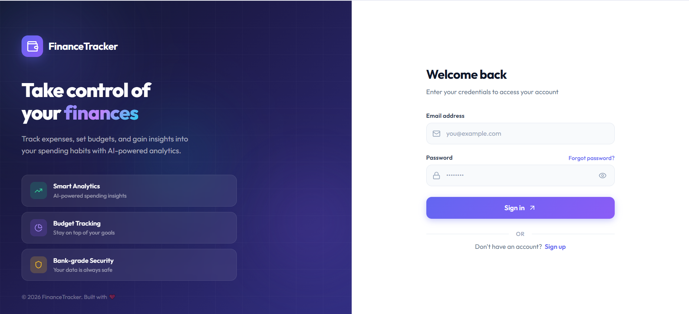
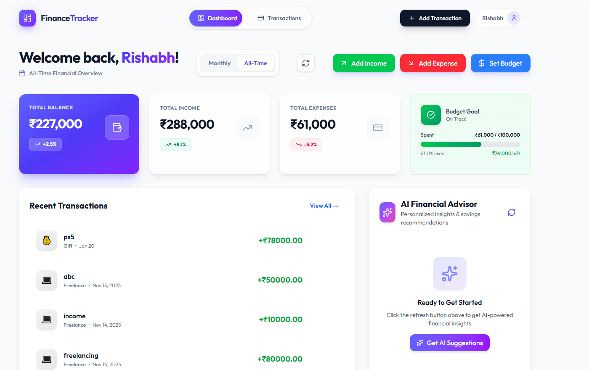

# AI Finance Management application

A full-stack personal finance management app built with React and Node.js. Track income and expenses, set budgets, and view monthly or all-time financial summaries — all in one place.

## Screenshots




## Tech Stack

- **Frontend:** React 19, Tailwind CSS 4, Recharts, Vite
- **Backend:** Node.js, Express, MongoDB (Mongoose)
- **Auth:** JWT + bcrypt

## Running Locally

### Prerequisites

- [Node.js](https://nodejs.org/) (v18 or higher)
- [MongoDB](https://www.mongodb.com/) (local instance or Atlas cluster)

### 1. Clone the repository

```bash
git clone https://github.com/rishabh0078/Finance-Management-application.git
cd Finance-Management-application
```

### 2. Setup the backend

```bash
cd backend
npm install
```

Create a `.env` file in the `backend` folder:

```env
PORT=8000
NODE_ENV=development
MONGODB_URI=your_mongodb_connection_string
JWT_SECRET=your_jwt_secret
CLIENT_URL=http://localhost:5173
```

Start the backend server:

```bash
npm start
```

### 3. Setup the frontend

Open a new terminal:

```bash
cd frontend
npm install
```

Create a `.env` file in the `frontend` folder:

```env
VITE_BACKEND_URL=http://localhost:8000/api
VITE_GEMINI_API_KEY=your_gemini_api_key
```

Start the frontend dev server:

```bash
npm run dev
```

The app will be running at [http://localhost:5173](http://localhost:5173).
